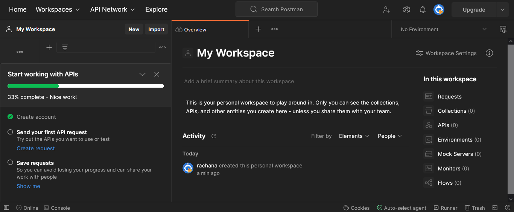
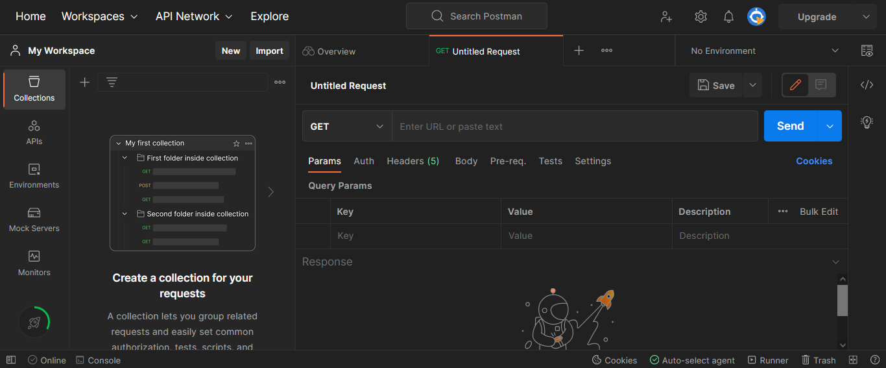
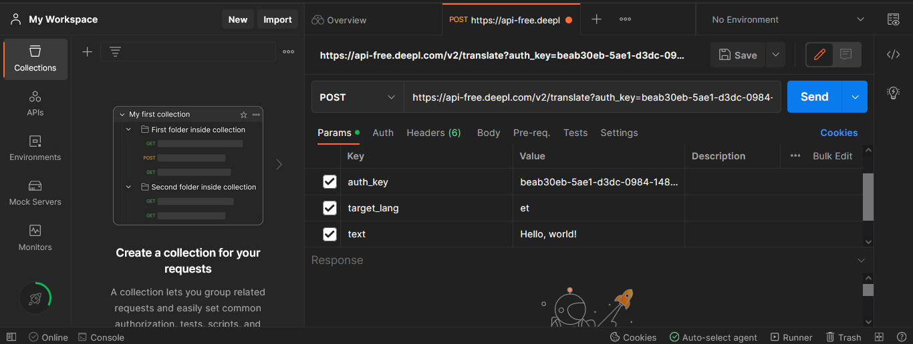
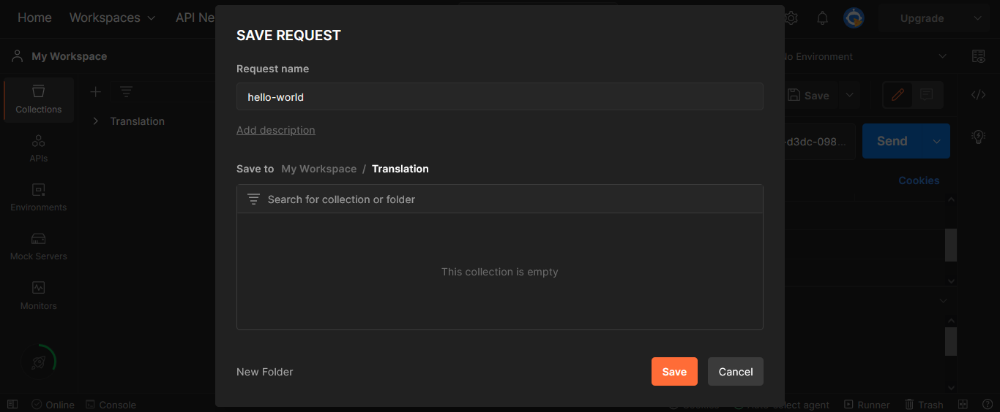
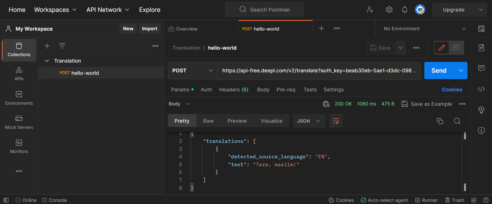

# How to use DeepL API

Postman is a software .... xxxx to be continued.
DeepL is .... xxxx to be continued.

Scenario: You want to test the DeepL API for text translation. You are using Postman for this.
This guide shows you how to call DeepL API endpoints to translate text using Postman.

## Prerequisites

1. A Postman account - you can create an account for free if you don't have one. See https://www.postman.com/ 
2. A DeepL account - you can create an account with the free plan. You need to provide your credit card details but you are not charged unless you manually upgrade to the pro plan. See https://www.deepl.com/translator

## Steps to translate
We are using the API endpoint **POST** `{domain}/v2/translate`. We are translating the phrase "Hello, world!" from English to Estonian. 

1. When you first log in to Postman, you can see the home page.

	

2. Click **Create request** from the left-hand menu to create our first API request. An **Untitled Request** opens which is set to the **GET** method by default.

	

3. Select the method **POST** from the drop-down menu. In the text bar next to the method, enter the URL `https://api-free.deepl.com/v2/translate`.
4. In the **Params** table, enter the following values:

	| Key  | Value |
	| ------------- | ------------- |
	| auth_key | Go to your DeepL account details and copy the authentication key here. |
	| target_lang | et |
	| text | Hello, world! |
  
	The request should look something like this: 
  
	

	>**Note**
	>For detailed information about the endpoint and the parameters, see [Translate Text](https://www.deepl.com/docs-api/translate-text/translate-text/).

5. Click **Save**. You are prompted to edit the request name and create a collection. A collection is a folder to save your requests.

	Enter the **Request name** as **hello-world** and create a collection called **Translation**. Once you have created the collection, you should see the following screen:
	
	
	
6. Click **Save**. The collection called **Translation** is created and the POST request **hello-world** is saved in this collection.

7. Now, click **Send**. For a successful request, you can see the translated text in the response body. The following screenshot shows the response:

	
	
You have now sent your first successful request in Postman. You can see the next section which describes how to send a GET request to view the list of available languages on DeepL.

>**Note**
>If you get any errors, see the [Error Handling](https://www.deepl.com/docs-api/api-access/error-handling/) section from DeepL for information. 
