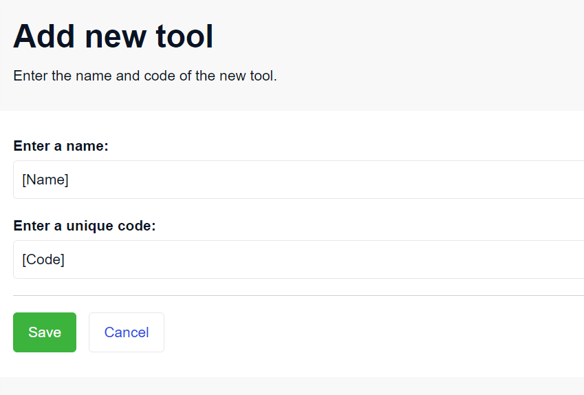
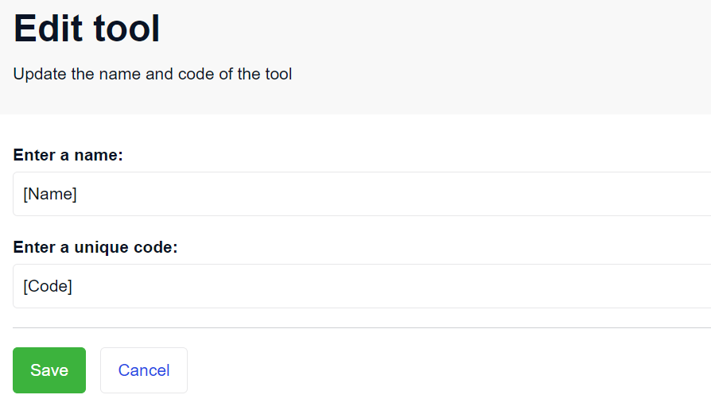
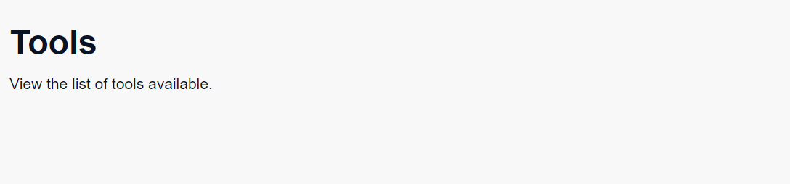
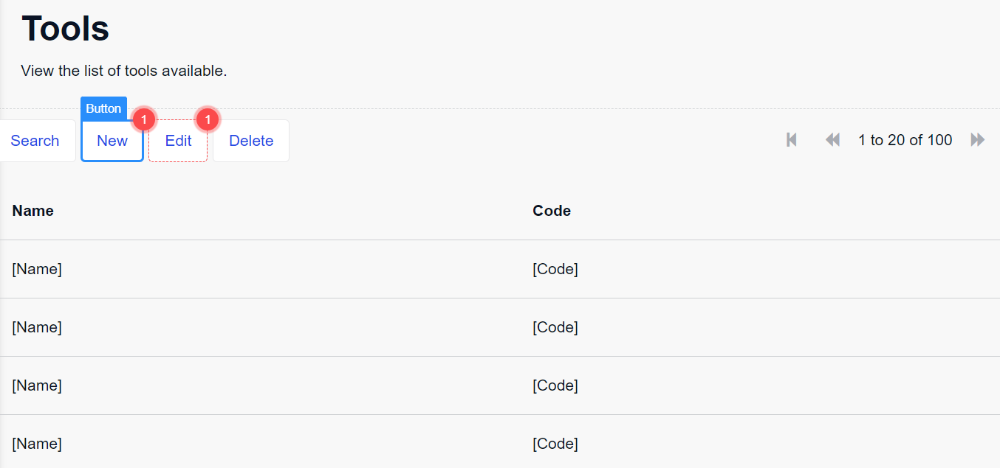
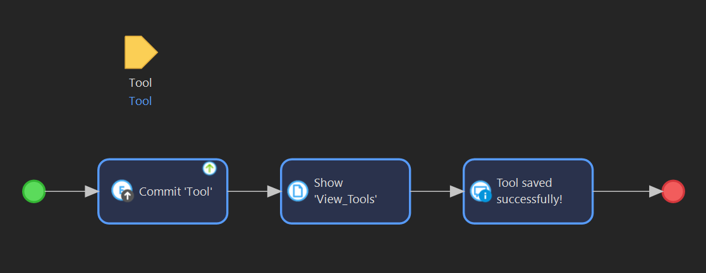
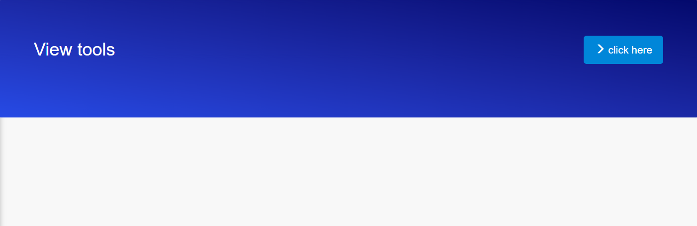
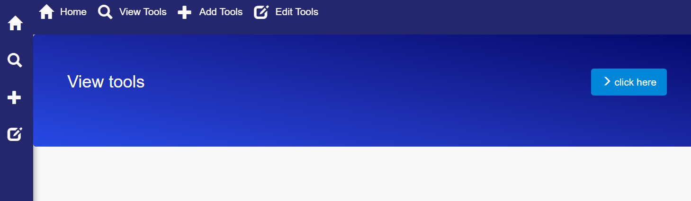

# Create an App to Display Tools

## 1 Introduction

This how-to explains how you can build an app in Mendix to view, add, and edit tools present in a hardware store. We will create and configure the pages to perform the functions.

This how-to will teach you how to do the following:
* Create an entity
* Create pages
* Create a microflow

## 2 Prerequisites

Before starting with this how-to, make sure you have completed the following prerequisites:
* Create your [free account](https://signup.mendix.com/link/signup/?source=quickstart-part1&medium=mxdocs)⁠ — which takes only two minutes to finish.
* [Download](https://marketplace.mendix.com/index3.html) and [install](https://docs.mendix.com/refguide/install/) Mendix Studio Pro.
* If you are working on a Mac, please complete [Configuring Parallels](https://docs.mendix.com/refguide/using-mendix-studio-pro-on-a-mac/) to install Studio Pro on your Mac.

## 3 Creating an App from an App Template

Here we will choose a starting point for the app. Make sure that you choose a starting point with a configured responsive web navigation profile because the app we will create in this guide needs to work for web browsers.

1. Starting from Studio Pro, click **Create New App**.
2. Search for the **Blank** web app and click **Use this starting point**.
3. Name the app *TW-2304* and click the **Create app** button.
4. Wait a few minutes for the app to be created, its team server to be initialized, and a local copy of the app to be downloaded to your machine. After that, the app will open on your app’s home page called **Home_Web**.

> **Note**    
> For more information, see [Build a Responsive Web App](https://docs.mendix.com/refguide/quickstart-part1/).

## 4 Creating an Entity

First, we will create an entity named *Tool* with the attributes *Name* and *Code*. 

1. To open the domain model, on the **App Explorer** pane on the left, under **MyFirstModule**, click **Domain model**.
2. To create an entity in the domain model, drag a new **Entity** from the **Toolbox** and drop it into the domain model (or right-click anywhere in the domain model to add a new entity).
3. Double-click the new entity to open its properties window.
4. Name the entity *Tool*:
	 - Under the **Attributes** tab in the entity’s properties, click **New**, name the attribute *Name*, and click **OK**.
	 - Repeat the process while adding the attribute called *Code*.

### 4.1 Adding Validation Rules to the Entity

Now we will define validation rules for the entity to ensure that users enter a name and a unique code for the tool. Otherwise, an error message will be displayed.

1. In the properties window of the entity, click the **Validation rules** tab.
2. Click **New**. On the **Validation Rule** window, select the **Name** attribute.
3. Enter the **Error message** as *Enter the name!*.
4. Leave the **Type** under **Rule** as *Required*. Click **OK**.
5. Again click **New** and on the **Validation Rule** window, select the **Code** attribute.
6. Enter the **Error message** as *Enter a unique code!*. Click **OK**.
7. Save the domain model.

## 5 Adding Pages

In this section, we will add 2 new pages - to add and view the list of tools. To add new pages to the app: 

1. In the **App Explorer** pane, right-click on **MyFirstModule**.
2. Click **Add page**.
3. Select **Blank Page Template**.

### 5.1 Creating the Page to Add Tools

1. On the **Create page** window, enter *Add_Tool* as the **Page name**.
2. On the new page that opens, drag the **Container** under **Structure** from the **Toolbox**. Drop the container in the **Layout Grid** at the top of the page.
3. Drag and drop the **Text** widget in the container.
4. Double-click **Text** and enter the **Caption** as *Add new tool*. Select **Render mode** as **Heading 1**. Click **OK**.
5. Drag and drop another text widget below the previous text.
6. Enter the **Caption** as *Enter the name and code of the new tool.* Click **OK**.

Next, we will add a form to get the name and code as input.

1. Drag and drop a container anywhere on the page below the text you entered.
2. From the **Building blocks** in the **Toolbox** pane, drag the **Form vertical with action block** and drop it in the container.
3. Delete the last 3 objects from the form, leaving only the **Name** and **Phonenumber boxes**. Delete the **Form title** text.
4. Now we need to link the entity **Tool** to the form so that the data is saved to the entity. To do this, select the **Data View** container which has the remaining form and double-click **Data Source**.
5. In the edit window, select the **Entity (path)** as **Tool**. Click **OK**.
6. When you are prompted to fill in the contents automatically, click **Yes**.
7. Double-click the **Name** text box and enter the **Label caption** as *Enter a name:*. Click **OK**.
8. Double-click the **Code** text box and enter the **Label caption** as *Enter a unique code:*. Click **OK**.
9. Save the page.

Your page should look something like this:

### 5.2 Creating a Page to Edit Tools

Now repeat the steps for a new page called *Edit_Tool*. Your page should look like this:

### 5.3 Creating a Page to View Tools

1. Repeat the steps to create a new page named *View_Tools* and add a heading at the top of the page. Your page should look like this:

	

2. Drag and drop a container on the page. In the container, drag and drop a **Data grid** widget.
3. Double-click the **No data source** tab to open the properties window.
4. Under the **Data source** tab, select the **Entity (path)** as **Tool**.
5. When you are prompted to fill in the contents automatically, click **Yes**. This step connects the data grid to the entity and it will display the list of tools.

The page should now look like this:

7. Next you will configure the buttons to open the add and edit pages you created: 
   - Double-click the **New** button.
   - In the properties window, enter the **Caption** as *Add*. For the **Page** field, select the **Add_Tool** page and click **OK**. 
   - Double-click the **Edit** button.
   - In the **Events** section, select **Show a page** for the **On click** event. Below this, select the **Page** as **Edit_Tool**.
   - Leave the **Delete** button as it is. This will delete the selected item from the list.
   - Save the page.
  
## 6 Adding Logic to the App Using a Microflow

We will use a microflow to link the pages we have created and display the data. To create a microflow:

1. Right-click **MyFirstModule** and click **Add microflow**.
2. Name the microflow *save_tool*.
3. Right-click anywhere on the microflow screen, select **Add**, and click **Parameter**. 
4. Double-click the parameter. In the **Output** section, leave the **Data type** as **Object**.
5. Below this field, select the **Tool** entity.

Now we will add logic for the app. The input from the **Add_Tool** and **Edit_Tool** pages needs to be saved and displayed on the **View Tools** page. When the tool is saved, the screen will display a success message. 

1. In between the start and end events, drag and drop a **Commit object(s)** activity from the **Toolbox**. The activity is automatically connected to the start and end activities. 
2. Double-click the **Commit** object. Select the **Input** as **Tool** and click **OK**.
3. Now drag a **Show page** activity and drop it next to the **Commit** object.
4. Double-click **Show page** and select the **Page** as **View_Tools**. This will show the **View_Tools** page with the list of the tools after the data of the tool is saved.
5. Drag a **Show message** activity and drop it next to the **Show page** activity. Double-click the message activity and enter *Tool saved successfully* as the **Template**. 

Your microflow should look like this:

## 6.1 Configuring the Pages

Now that we have created the microflow, we will configure the **Save** and **Cancel** buttons on the pages.

Go to the **Add_Tool** and **Edit_Tool** pages and follow these steps:

1. For the **Save** button: 
   - Double-click the **Save** button. 
   - In the **Events** section, select the **On click** event as **Call a microflow**. 
   - Select the **Microflow** as **save_tool**. 
   - Click **OK**. 
2. For the **Cancel** button:
   - Double-click the **Cancel** button. 
   - In the **Events** section, select the **On click** event as **Show a page**.
   - Select the **View_Tools** page.
 
As a result, when the **Save** button is clicked, the **save_tool** microflow will be called. The name and code are saved and will be displayed in the list of tools on the **View_Tools** page. If the user cancels the input, the **View_Tools** page will be displayed again.

## 7 Configuring the Home Page

In this section, we will first link the home page to the **View_Tools** page. 

### 7.1 Adding a Link to the List of Tools

1. On the **Home_Web** page, delete the existing text. Drag and drop a container in its place. 
2. Drag a **Card action** building block and drop it in the container.
3. Double-click the text and enter the **Caption** as *View tools* and select the **Render mode** as **Heading 3**.
4. Double-click the **>** button at the end of the card. In the **Caption** field, enter *click here*.
5. Select the **Render mode** as **Button**. 
6. Select the **Button style** as **Info**.
7. In the **Events** section, select the **On click** event as **Show a page**, and select **View_Tools**.
8. Click **OK**.

If you want to change the appearance of the widget, follow these steps:
1. Double-click the container and click the **Appearance** tab in the properties window. 
2. Select **Brand Gradient** as the **Background color**. Click **OK*.
3. Double-click the text box and go to the **Appearance** tab. 
4. Select the **Weight** as **Normal** and the **Color** as **White**. Click **OK*.

Your home page should look like this:

### 7.2 Adding a Navigation Bar

Now we will add a navigation bar so that users can go to the other pages.

1. From the **ToolBox**, drag the **Menu bar** widget, and drop it above the container with the text.
2. Right-click the **Menu bar** and select **Go to menu**. The **Navigation** properties window opens in a new tab.
3. Scroll to the **Menu** section and add the pages as new items.
4. For the **Add_Tools** page:
   - Click **New item**. Enter the **Caption** as *Add Tools*. 
   - Select the **Icon** as the plus sign **+**.
   - Select the **On click** event as **Create object**. 
   - Select the **Entity (path)** as **Tool** and select the **On click page** as **Add_Tool**. 
   - Click **OK**.
7. Repeat the steps for the **Edit_Tool** page. You can select the **Icon** as **Glyphicon 'edit'**.
8. For the **View_Tools** page:
   - Click **New item**. Enter the **Caption** as *View Tools*.
   - Select the **Icon** as the **search** glyphicon.
   - Select the **On click** event as **Show a page**.
   - Select the **Page** as **View_Tools**.
   - Click **OK** and save the navigation properties.

Your home page should now look like this:

## 8 Running the App

Save your pages and click the **Run locally** button on the top menu. When the build is ready, click **View App** to test your app on your browser. Once you are satisfied with the app, click **Publish**. This will push your app to a cloud environment or a web container connected to your app. If none exists, an environment will be initialized for your app on the Mendix Cloud Free Tier EU. You can view your deployed app on the [Mendix Developer Portal](https://home.mendix.com). 
